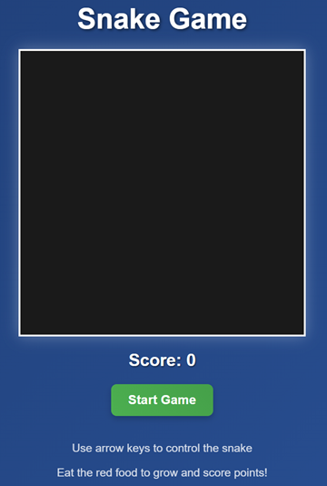

# Snake Game

Welcome to the Snake Game project! This is a classic snake game implemented in TypeScript, featuring a simple yet engaging gameplay experience. Perfect for both beginners to programming and gaming enthusiasts who enjoy nostalgic arcade-style games.



This project demonstrates the use of TypeScript, HTML5 Canvas, and modern JavaScript practices to create an interactive browser game that's both fun to play and educational to study.

## Project Structure

The project is organized as follows:

```
snake-game
├── src
│   ├── game
│   │   ├── Snake.ts          # Manages the snake's position, length, and movement.
│   │   ├── Food.ts           # Generates food items for the snake to eat.
│   │   ├── Grid.ts           # Defines the game area and checks boundaries.
│   │   └── GameEngine.ts     # Orchestrates the game logic.
│   ├── ui
│   │   ├── GameCanvas.ts      # Handles rendering of the game on a canvas.
│   │   ├── ScoreDisplay.ts     # Manages the display of the player's score.
│   │   └── GameControls.ts     # Handles user input for controlling the snake.
│   ├── utils
│   │   ├── collision.ts        # Functions for detecting collisions.
│   │   └── random.ts           # Generates random positions for food items.
│   ├── app.ts                  # Main entry point of the application.
│   └── index.ts                # Starting point for the application.
├── styles
│   └── main.css                # Styles for the game.
├── index.html                  # Main HTML file that includes the canvas.
├── package.json                # Configuration file for npm.
├── tsconfig.json               # Configuration file for TypeScript.
└── README.md                   # Documentation for the project.
```

## Getting Started

To get started with the Snake Game, follow these steps:

1. **Clone the repository:**
   ```
   git clone <repository-url>
   cd snake-game
   ```

2. **Install dependencies:**
   ```
   npm install
   ```

3. **Build the TypeScript code:**
   ```
   npm run build
   ```

4. **Start the development server:**
   ```
   npm start
   ```

5. **Open the game:**
   Open your browser and navigate to `http://localhost:3000`

### Alternative Manual Launch
If you prefer to run without the dev server:
1. Build the TypeScript code with `npm run build`
2. Open the `index.html` file directly in your browser

### Game Controls
- Use **Arrow Keys** to control the snake
- Press **Start Game** button to begin
- Try to eat as many food items as possible without hitting walls or yourself

## Gameplay

In this game, you control a snake that moves around the grid, eating food to grow longer. The objective is to eat as much food as possible without colliding with the walls or yourself.

## Features

- **Classic Snake Gameplay**: Control a snake with arrow keys to eat food and grow longer
- **Score Tracking**: Keep track of your current score as you collect food
- **Collision Detection**: Game ends when your snake hits the walls or itself
- **Responsive Design**: Adapts to different screen sizes
- **Modern Graphics**: Clean, visually appealing design with smooth animations
- **Restart Functionality**: Easily restart the game after losing
- **Kid-Friendly**: Simple controls and visuals make it perfect for players of all ages

## Development

This project uses TypeScript for type-safe development and a modern development workflow.

### Available Scripts

- `npm run build` - Compiles the TypeScript files into JavaScript in the `dist` folder
- `npm start` - Starts a development server using lite-server with auto-reload
- `npm run watch` - Watches for TypeScript file changes and rebuilds automatically

### Project Configuration

- **TypeScript Configuration**: The `tsconfig.json` file is set up to use ES6 modules for browser compatibility
- **Module System**: Uses ES modules (import/export) for browser compatibility
- **Development Server**: Uses lite-server for easy local development with auto-reload

### Browser Compatibility

The game is designed to work in modern browsers with ES6 support. It uses:
- ES6 Classes
- ES6 Modules
- HTML5 Canvas API
- Modern CSS features

## Troubleshooting

- **Arrow Keys Not Working**: If arrow keys cause page scrolling instead of controlling the snake, try clicking on the game canvas first to focus it
- **Game Not Starting**: Check browser console for errors, ensure all TypeScript files were successfully compiled
- **Modules Not Loading**: Make sure your browser supports ES6 modules and that you're using a server (not opening the file directly)

## Contributing

If you would like to contribute to this project, please fork the repository and submit a pull request with your changes.

## License

This project is licensed under the MIT License. See the LICENSE file for more information.